# Screen time analytics

Table of Contents
=================

   * [Quick User Guide - How to add screen time analytics](#quick-user-guide---how-to-add-screen-time-analytics)
      * [Aim of this document](#aim-of-this-document)
      * [Steps to follow](#steps-to-follow)
      * [Matomo analytics configuration](#matomo-analytics-configuration)
      * [Google analytics configuration](#google-analytics-configuration)

# Quick User Guide - How to add screen time analytics

## Aim of this document

This document is targeted to **IT web developers** and **Web analytics users** for the web integration of the EEA Analytics Plugin.
The plugin introduces more advanced and precise way of measuring reading/usage score of Web content than the default Matomo/Google Analytics provides.
It will tell you exactly **how many are really reading your web content** and **how many are just scanners or looking around**.

Contact Antonio De Marinis for more details.

## Steps to follow

Who: Web developer.

The following steps should be performed in order to have screentime analytics tracking with Matomo/Google Analytics:
1. Make sure you load matomo/google analytics script
1. Load **eea_screentimeanalytics.js** within your site by performing the following steps:
   1. On a non Plone installation simply load **eea_screentimeanalytics.js** within the site header
   1. On a Plone site do the following steps:
      1. Install or update EEA Jquery to the latest version available
      1. Import all steps from **EEA jQuery - EEA Screentime Analytics** profile
      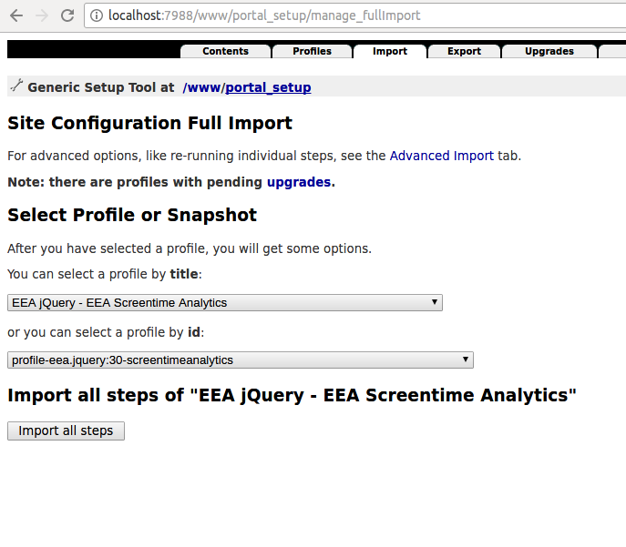

1. Add within a javascript a call to the jQuery plugin with the context set to the content area you want to track
   ex: <pre>
               $("#content-core").screentimeAnalytics();
      </pre>

   See the [github page](https://github.com/collective/eea.jquery/blob/master/eea/jquery/plugins/eea_screentimeanalytics/eea_screentimeanalytics.js#L633) for parameters which you can pass in case you want to modify the behaviour of the script
   ex:
   <pre>
      $("#content-core").screentimeAnalytics({debug: true});
   </pre>
   in case you want to get console information instead of sending events to matomo/google
1. Configure Matomo/Google analytics to record the metrics given by the javascript as described in the next section

## Matomo analytics configuration

Who: Matomo Analytics Administrator.

1. Create a new **goal**:
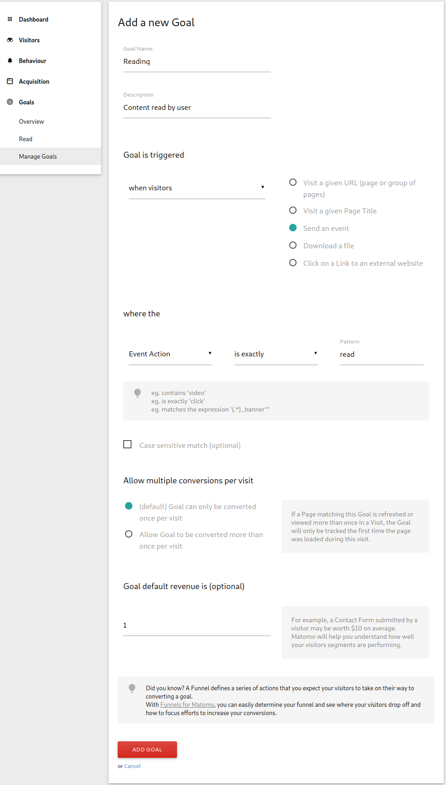
1. Configure **Reader Type** custom dimension:
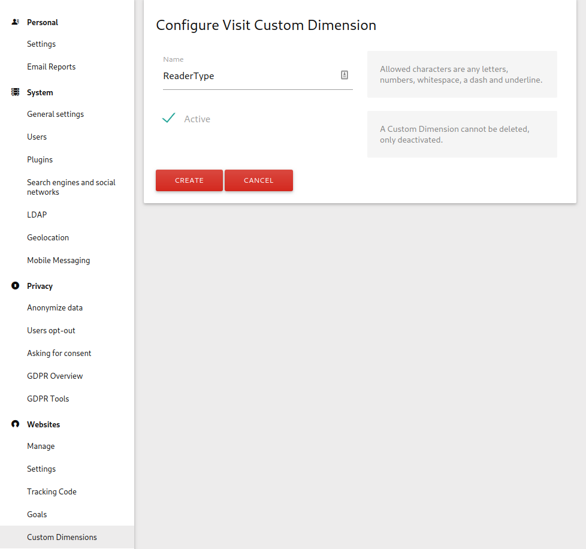
1. **Custom variables** (no server-side action required):
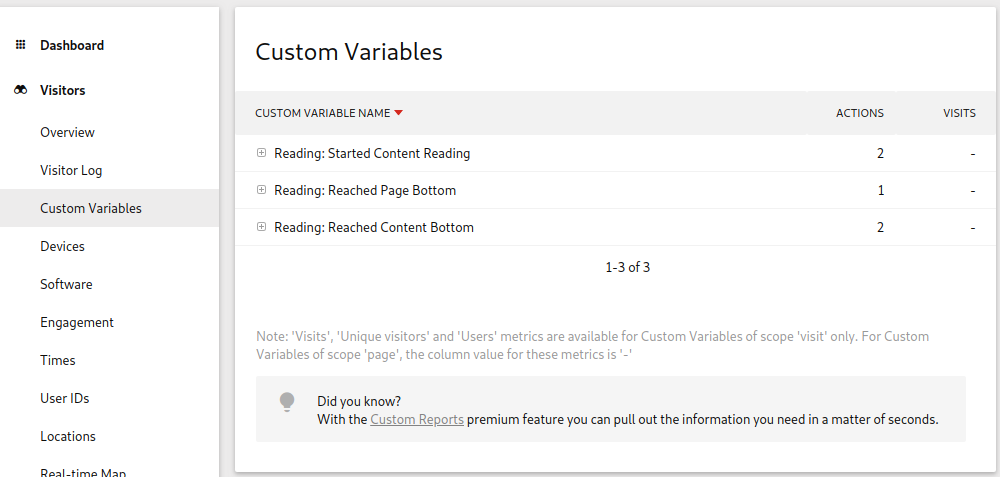

## Google analytics configuration

Who: Google Analytics Administrator.

1. Create a new **goal**:
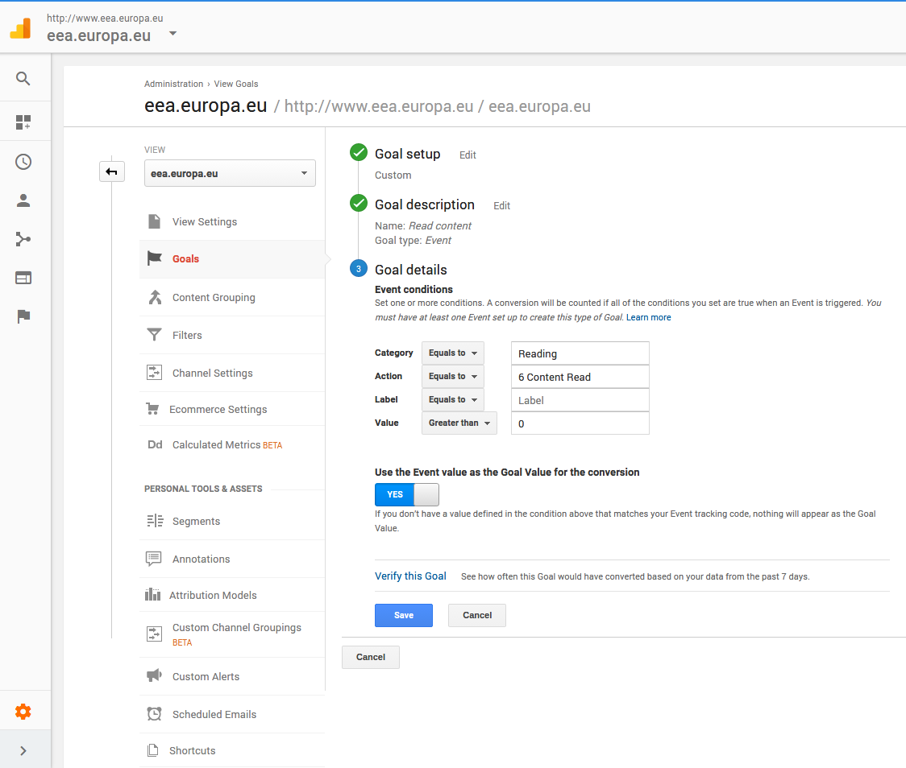
1. Create the following **Custom metrics**:
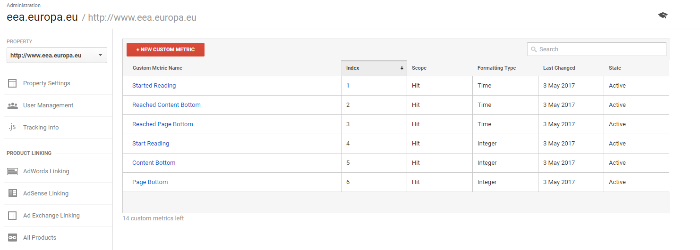
1. Create the following **Calculated metrics** see individual metric bellow:
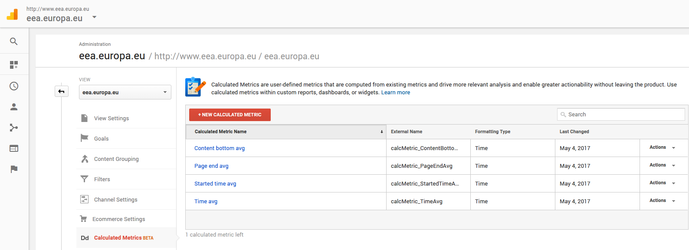
1. Configure **Started time avg** custom metric:
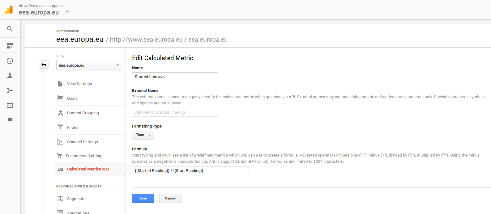
1. Configure **Content bottom avg** custom metric:
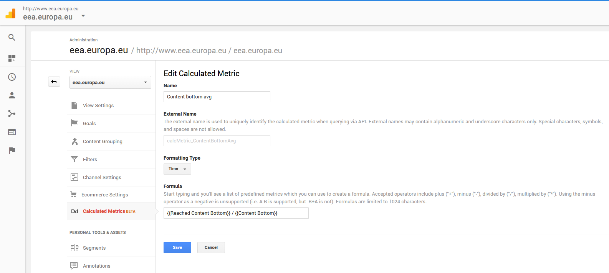
1. Configure **Page end avg** custom metric:
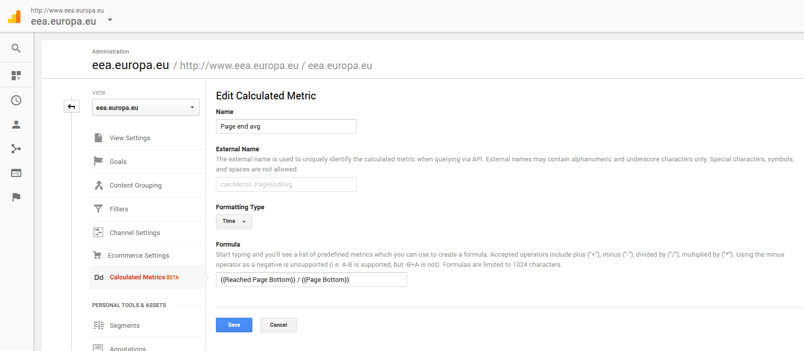
1. Configure **Time avg** custom metric:
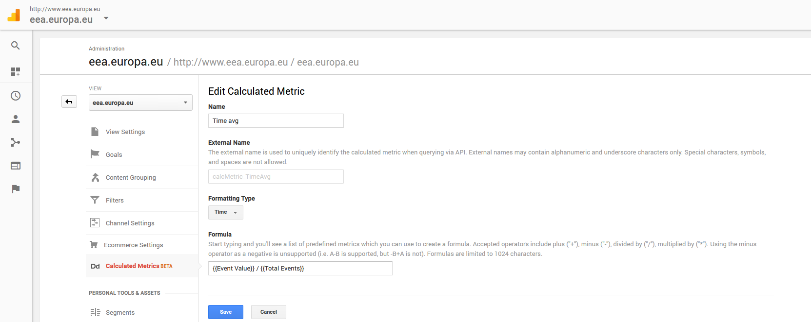

1. Configure **ReaderType** custom dimension:
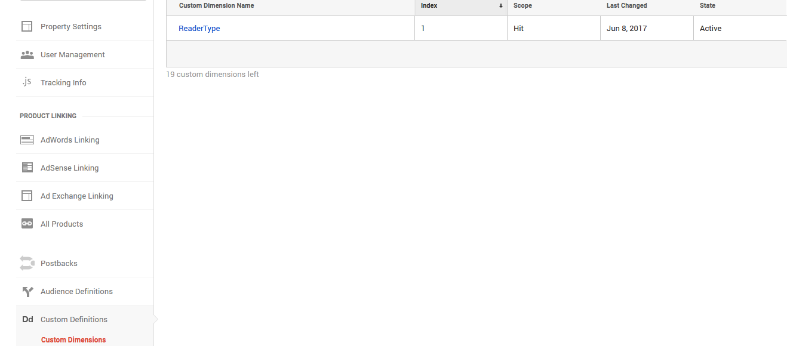
1. Clink to import the **["Reading time custom report"](https://analytics.google.com/analytics/web/template?uid=W8VkKVrVQQi5pdF3f-Ig2A)** as seen bellow:
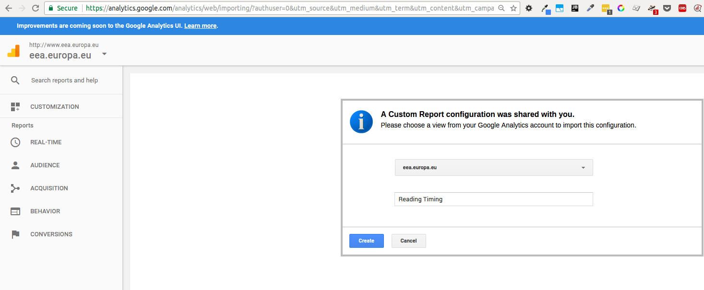
1. Clink to import the **["Reading stats - others custom dashboard"](https://analytics.google.com/analytics/web/template?uid=udjee9WQQdSoICOpCbv1cA)** as seen bellow:

After a few days you can see several reports such as the following:

1. **Matomo Analytics**

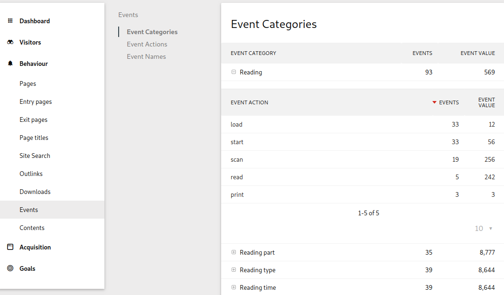

1. **Google Analytics**

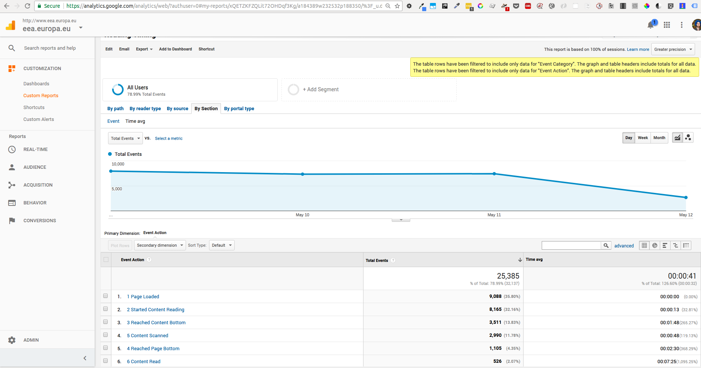

Or you can check from the goals page and see how many conversions you had for the goal of the page being read

1. **Matomo Analytics**

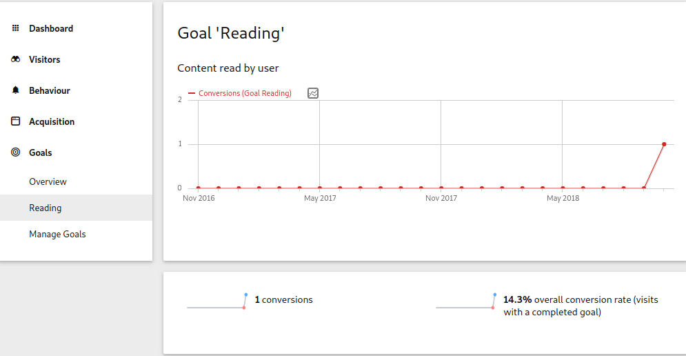

1. **Google Analytics**

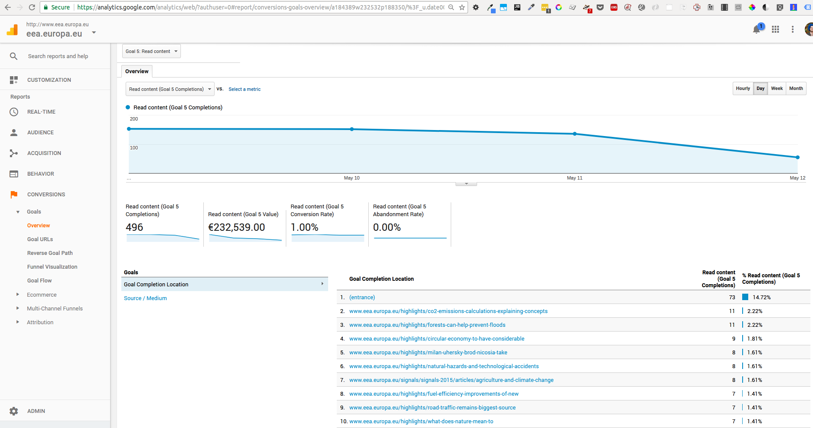
